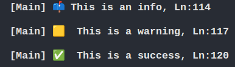
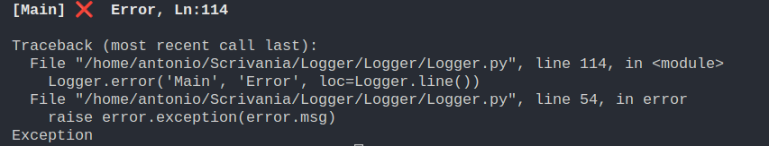
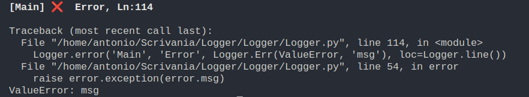
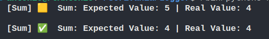
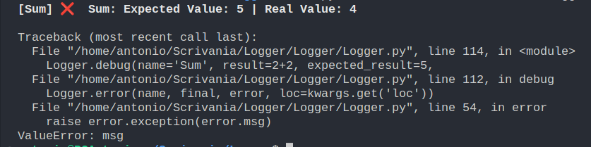

# Logger

Logger is a Python package that makes logging easy

# Installation
```sh
pip install logger
```

## Get Started 

#### Info, Warning, Success

Every method takes in an area, a message and an option loc which represents the current line of code, it can be got by using 'Logger.line()' or by passing an integer

```python
from Logger import Logger

Logger.info(area='Main', message='This is an info', 
        loc=Logger.line())

Logger.warning(area='Main', message='This is a warning', 
        loc=Logger.line())

Logger.success(area='Main', message='This is a success', 
        loc=Logger.line()) 
        
```
#### Output


#### Error
The error method provides an exception that can be passed by the user with a message or it will be the default 'Exception' raised with an empty string

##### default

```python
Logger.error(area='Main', message='Error',loc=Logger.line())

```



##### custom error
```python
Logger.error(area='Main', message='Error', 
    error=Logger.Err(ValueError, 'msg'),loc=Logger.line())
```



### You can also perform and check operation (of two types)

#### Operation

It will be 'raised' a success if the operation goes as it should, a warning otherwise

```python
    
Logger.operation(name='Sum', result=2+2, expected_result=5)

Logger.operation(name='Sum', result=2+2, expected_result=4)
```


#### Debug

It will be 'raised' a success if the operation goes as it should, an error otherwise

```python
Logger.debug(name='Sum', result=2+2, expected_result=5,
    error=Logger.Err(ValueError, 'msg'))

Logger.debug(name='Sum', result=2+2, expected_result=4,         
    error=Logger.Err(ValueError, 'msg'))
```



Github: https://github.com/Bilodev/